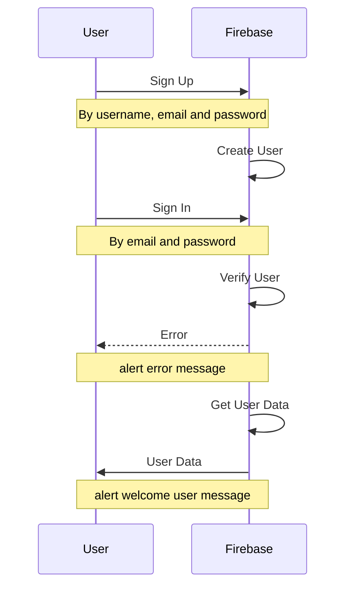
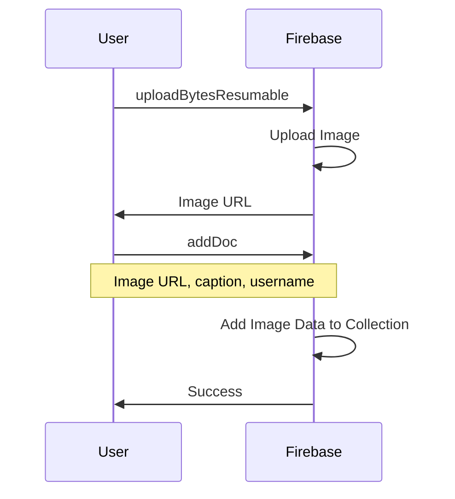
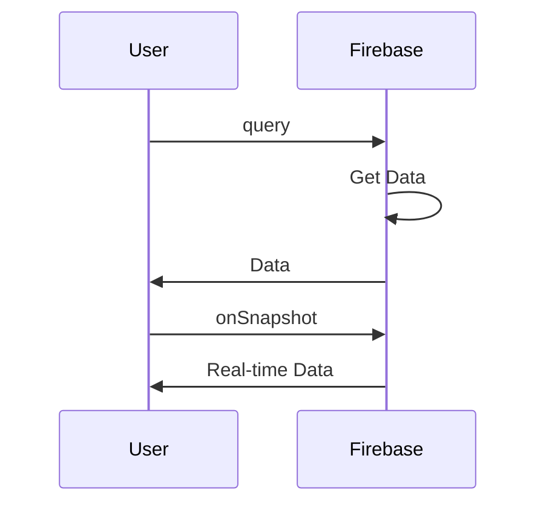
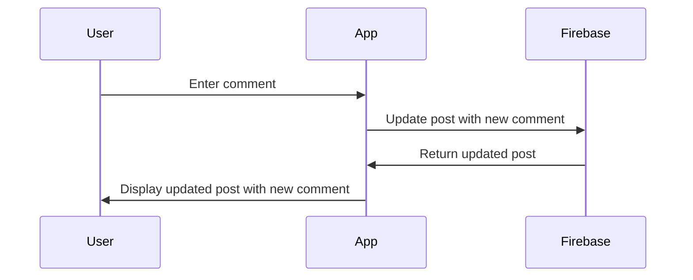

# Instagram clone and story

 > 本專案為模擬 Instagram 之限時動態及貼文之功能，亦可進行註冊及登入，並上傳圖片及貼文，以及進行留言。限時動態可依不同用戶顯示該用戶的圖文，並設定自動輪播及暫停播放功能。

## 作品網址
- [Instagram](https://react-typescript-ig-stories.web.app/)
  - 帳號：admin@admin.com
  - 密碼：12345678

  
## 目錄
- [Instagram clone and story](#instagram-clone-and-story)
  - [作品網址](#作品網址)
  - [目錄](#目錄)
  - [工具](#工具)
  - [專案特點](#專案特點)
    - [登入頁面](#登入頁面)
    - [上傳圖片至 firebase](#上傳圖片至-firebase)
    - [獲取 firebase 資料](#獲取-firebase-資料)
    - [新增留言](#新增留言)
  - [Demo](#demo)
  - [作者](#作者)

## 工具
- React 18
- TypeScript
- Redux
- firebase
  
## 專案特點
- 限時動態：
  - 功能：以 Redux 管理每個用戶及每位用戶所上傳的圖片，並以 setTimeout 設定定時器，使每五秒進行輪播，而亦可實現暫停播放功能。
  - UI：以純 CSS 實現三面立體旋轉功能，並以 redux action 控制旋轉樣式。
- 登入註冊頁面：
以 firebase 作為資料庫，使用 createUserWithEmailAndPassword 及 signInWithEmailAndPassword 實現註冊及登入功能，再以 onAuthStateChanged 設置身份驗證狀態並獲取用戶數據。
- 貼文串：同樣以 firebase 作為資料庫，建立 posts collection，再使用 onSnapshot 得到即時更新的貼文資料。
- 圖片上傳介面：使用 firebase 的 uploadBytesResumable function 上傳圖片檔案，當上傳成功後將得到的圖片 url 及其他貼文資訊以 addDoc 方法新增至 posts collection。
- 留言功能：於每則貼文串新增 comments collection，並以 updateDoc 更新留言
### 登入頁面

### 上傳圖片至 firebase

### 獲取 firebase 資料

### 新增留言

## Demo
- 限時動態：

- 上傳貼文：

- 留言：

## 作者
藍奕欣
[Github](https://github.com/ysl0628) 
Email: yihsinlan@gmail.com